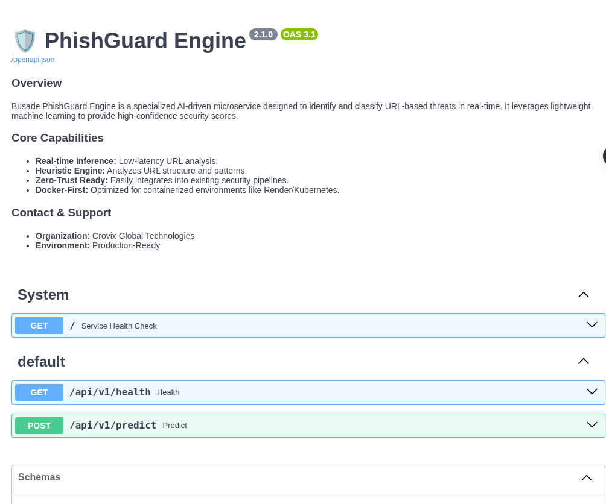
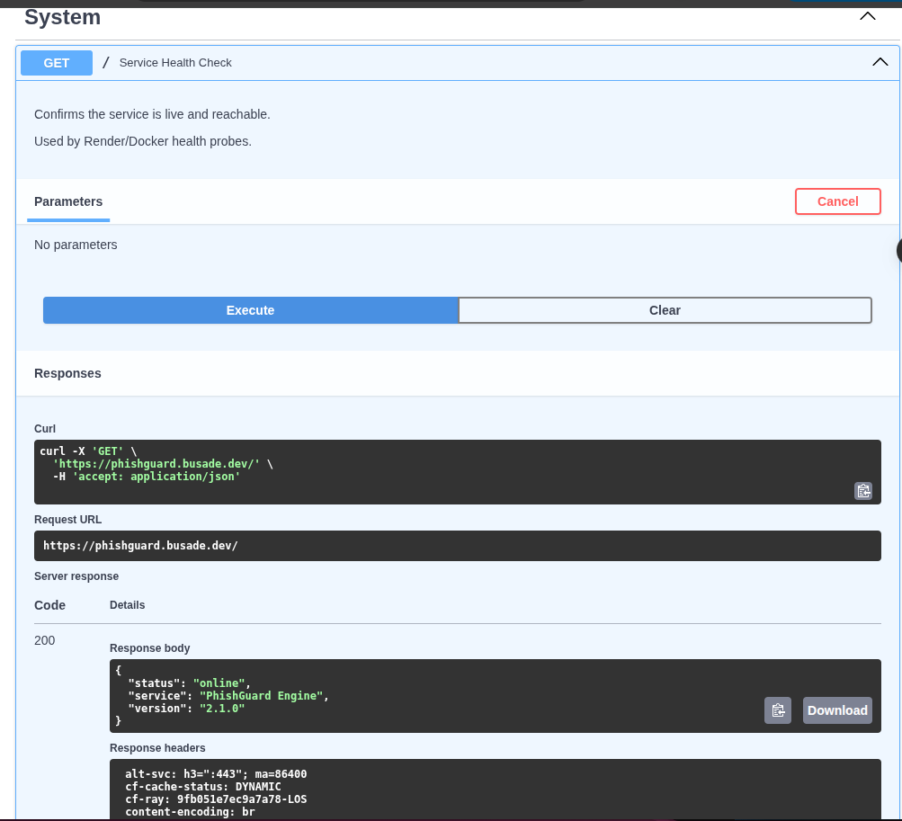

 ---
 # 🛡️ PhishGuard Engine

<p align="center">
  
  
  
  
  
</p>

---

## 🌐 Live Demo

👉 **Live API:**

```
https://phishguard-engine.onrender.com/docs
```

---

## 🖼️ Screenshots

### 📌 Swagger API Interface



---

### 📌 Prediction Example


---

### 📌 Health Check Endpoint



---

## 🚀 Overview

**PhishGuard Engine** is a lightweight machine learning system for detecting suspicious URLs using structural feature analysis.

It is designed as a **production-style ML inference service**, not a notebook prototype.

---

## 🎯 Key Features

* ⚡ FastAPI-based REST API
* 🧠 Logistic Regression ML model
* 🪶 Lightweight feature extraction
* 🔐 Offline inference (no external APIs)
* 📦 Docker-ready deployment
* 📊 Real-time URL classification

---

## 📂 Dataset

Add:

Due to size constraints, raw datasets are not included in this repository.

To reproduce training:

1. Download phishing dataset from Kaggle  
2. Download PhishTank dataset  
3. Prepare legitimate URL dataset  
4. Run:

```bash
python src/dataset_builder.py
```

---

# 🔥 Senior-Level Touch (Highly Recommended)

Create:

```bash
mkdir data/sample
```

> Add small file:

**data/sample/sample_urls.csv**

---

## 🧠 System Architecture

```text
Client
  ↓
FastAPI Gateway
  ↓
Feature Extraction Layer
  ↓
ML Model (Logistic Regression)
  ↓
Prediction Response
```

---

## 🔍 Feature Engineering

Each URL is converted into numerical signals:

* URL length
* Number of dots
* Digits count
* Special characters
* Subdomain depth
* Entropy score
* Suspicious keyword frequency

---

## 🤖 Machine Learning Model

* Algorithm: Logistic Regression
* Type: Binary Classification
* Framework: Scikit-learn
* Output: Probability-based prediction

---

## 📡 API Endpoints

### Health Check

```http
GET /api/v1/health
```

Response:

```json
{ "status": "ok" }
```

---

### Predict URL

```http
POST /api/v1/predict
```

Request:

```json
{ "url": "https://example.com" }
```

Response:

```json
{
  "prediction": "legitimate",
  "confidence": 0.92,
  "domain_resolves": true
}
```

---

## ⚙️ Installation

```bash
git clone https://github.com/olubusade/phishguard-engine
cd phishguard-engine

python -m venv venv
source venv/bin/activate

pip install -r requirements.txt
uvicorn app.main:app --reload
```

---

## 🐳 Docker Deployment

```bash
## 🚀 PhishGuard Engine - Installation & Setup

### Prerequisites
- Docker & Docker Compose
- Python 3.12 (for local venv testing)

### Local Development (Using Docker)
We use a `Makefile` to simplify Docker operations. 

1. **Build the image:**
```bash
   make build
```
2. **Run the engine:**
```bash
make run
```
The API will be available at http://localhost:8000 and Swagger docs at http://localhost:8000/docs.

3. **Stop the engine:**

```bash
make stop
```
4. **View live logs:**

```bash
make logs
```
5. **Quick Refresh (Rebuild & Restart):**

```Bash
make up
```

---

## ☁️ Deployment Options

* Render
* Railway
* AWS EC2
* Docker VPS

---

## 📊 Model Performance

* Accuracy: ~94%
* Precision: ~93%
* Recall: ~92%
* F1 Score: ~93%

---

## ⚠️ Limitations

This system:

* Does NOT verify real website existence
* Does NOT perform live browsing
* Does NOT use external threat intelligence APIs
* Is purely pattern-based ML classification

---

## 🧱 Project Structure

```
app/
 ├── api/
 ├── core/
 ├── schemas/
 ├── services/
 ├── utils/
 └── main.py

models/
data/
train_model.py
Dockerfile
README.md
```

---

## 👨‍💻 Author

**Busade Adedayo**
**Solution Architect & Senior Software Engineer** (Healthcare Systems)

* 8+ years of professional software engineering experience, including **4+ years full-time** building and maintaining production Electronic Medical Records (EMR) systems and **3+ years** as a consultant to a leading EMR solutions provider.
* Strong focus on scalable **enterprise solution architecture**, clinical workflow optimization, auditability, and production reliability.
* Experience with hospital-grade workflows
* AWS Cloud Practitioner certified and currently preparing for the **AWS Solutions Architect Associate** certification.
* Broad experience across backend systems, cloud architecture, and enterprise software solutions.
* 
---

## 📜 License

Educational / Portfolio Use Only

---

## 🔮 Future Improvements

* Google Safe Browsing integration
* PhishTank real-time validation
* SHAP explainability layer
* CI/CD pipeline (GitHub Actions)
* Kubernetes deployment
* Risk scoring engine (0–100)

---
